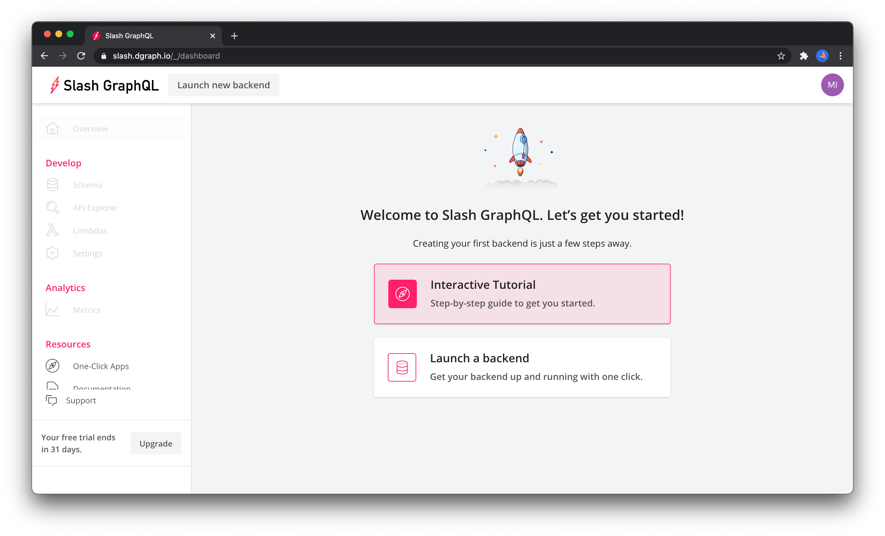
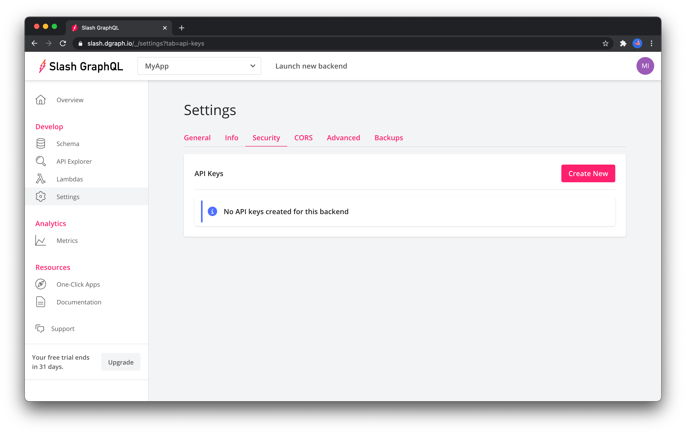

Slash GraphQL + Auth0 gives you a serverless GraphQL app building stack that includes identity management through [Auth0](https://auth0.com/) and authorized data access through [Slash GraphQL](https://dgraph.io/slash-graphql).  Combined with, for example, app deployments on [Netlify](https://www.netlify.com/) or [Vercel](https://vercel.com/), it's a serverless app stack that can scale from MVP to large apps that need global deployments and a distributed database backend.

# Auth0 + Slash GraphQL integration quick start

This repo contains material to get started quickly building an app with Auth0 and Slash GraphQL. 

It contains:

* A minimal React app
* Auth0 setup 
* Slash GraphQL setup

For a walk-through of how to build apps in the Auth0+Slash GraphQL+Netlify stack, check out [this blog post on Auth0 blog](FIXME to come) (based on [this Github repo](https://github.com/dgraph-io/tudo-tutorial)), or [Dgraph's tutorials on building apps with Slash GraphQL](https://dgraph.io/learn).  There's also [another example app](https://github.com/dgraph-io/discuss-tutorial) that was built from the starting point of this integration guide.

# Using the quick start

To use this quick start you'll need:

* An account at Slash GraphQL to deploy hosted GraphQL backends - register [here](https://dgraph.io/slash-graphql)
* An account at [Auth0](https://auth0.com/) to setup identity management.

This quick start automates some setup (e.g. Auth0 settings) that would otherwise require point and click in the web interface.  There's a minimal amount of setup that just needs to be done before the automation can take over.

To run the quick start, you'll need to clone this repository and work from the cloned directory.

```sh
git clone https://github.com/dgraph-io/auth0-integration
cd auth0-integration
```

## Step 1 - Setup an Auth0 tenant

Once you have signed up for [Auth0](https://auth0.com/), logged in, and created a new tenant (or use the default tenant), you'll need to create a token that allows automating Auth0 setup through its management API.  Navigate to the "APIs" tab, select the "Auth0 Management API", navigate to the "API Explorer" tab and then press the "CREATE & AUTHORIZE TEST APPLICATION" button.


That will create a new application with authorization to access the management API.  Navigate to the "Applications" tab, and select the newly created "API Explorer Application".


Using the values for that application, create a file `deploy/Auth0/config.development.json` with the following JSON modified for your values.

```json
{
    "AUTH0_DOMAIN": "[your tennant].auth0.com",
    "AUTH0_CLIENT_ID": "[your client id]",
    "AUTH0_CLIENT_SECRET": "[your client secret]",
    "AUTH0_APP": "MyApp",
    "AUTH0_CUSTOM_CLAIMS": "https://myapp.io/claims"
}
```

There's a `.gitignore` file that ignores that config file, making sure you don't check your API secrets into GitHub.

Then, head over to your "Tenant Settings" and select the "Signing Keys" tab.


Scroll down to find the "List of Valid Keys" and copy the "Key ID" of the key with the status "CURRENTLY USED" - that's the key that Auth0 is currently using to sign JWT tokens when users sign into apps built using that tenant.  Copy the key ID into the "kid" field in `deploy/SlashGraphQL/auth.development.json`.  While you're in that file, also remove the `[your tenant]` place holders and set them to the actual name of your Auth0 tenant.

Now, create the Auth0 setup by firstly, installing the javascript dependencies (this will take a few moments).

```sh
yarn install
```

Then, setup the Auth0 configuration with

```sh
yarn run deploy-auth0
```

Once that has completed, Slash GraphQL needs to know the ID of the Auth0 application just created, so select the newly created "MyApp" in the "Applications" tab and copy the "Client ID" into the "audience" field of `deploy/SlashGraphQL/auth.development.json`


## Step 2 - Deploy a Slash GraphQL backend

After you have signed up for Slash GraphQL, [login](https://slash.dgraph.io/), navigate to the dashboard, or use the backend selector to create a new backend. 



Once the backend has been created:


record the "Backend Endpoint" URL (minus the `/graphql` suffix) and copy this into the `REACT_APP_SLASH_GRAPHQL_ENDPOINT` value in the `.env` file in this directory.  It should look something like:

```
REACT_APP_SLASH_GRAPHQL_ENDPOINT=https://some.backend.dgraph.io
```

with your actual backend URL.

Then navigate to the "Settings" tab and click the "Add API Key" button to create a new API key.  Keep a record of this key, because it will be needed in a moment.



The `deploy/SlashGraphQL/auth.development.json` file now has enough information to link Slash GraphQL and Auth0, so add a GraphQL schema for the app with the following command and enter the Slash GraphQL API key when prompted.

```sh
yarn run deploy-slash
```

That sets the minimal schema in `deploy/SlashGraphQL/schema.graphql` as the schema for the GraphQL backend you deployed.

## Step 3 - App setup

The React sample app allows a user to log into Auth0 and fetch only the data from Slash GraphQL that they are authorized to --- in this instance only their own user data. 

The app needs to identify itself with Auth0, so copy the Auth0 app's "Domain" and "Client ID"  from the "MyApp" details in the Auth0 "Applications" tab into the `Auth0Provider` in `src/index.js`.

```js
ReactDOM.render(
  <Auth0Provider
    domain="[your app's Domain]"
    clientId="[your app's Client ID]"
    redirectUri={window.location.origin}
  >
```

## Step 4 - run the app 

Now you've deployed a Slash GraphQL backend and Auth0 app for secure access.  You can  start the app and sign up as a new user.

```sh
yarn start
```

There's not much to do in the app at this point, but you have a working Slash GraphQL and Auth0 setup running, so start working on your schema in `deploy/SlashGraphQL/schema.graphql` and build a serverless GraphQL app.

The app works with username+password signup, not social sign in.  If the app allows social sign in, or needs to enrich the claims in the JWT with data from Slash GraphQL, then further rules and hooks are needed for those flows. 

# Learn more

* Read a tutorial on building apps with Slash GraphQL in [Dgraph's Learn courses](https://dgraph.io/learn)
* Find out what's possible with Dgraph and Slash GraphQL in the [docs](https://dgraph.io/docs/graphql/overview/)
* Check out the [Slash GraphQL npm package](https://www.npmjs.com/package/slash-graphql) for more command line configuration options for Slash GraphQL.
* Learn more about auth use cases and settings in Auth0's [docs](https://auth0.com/docs/).
* Dig into Auth0's [management API](https://auth0.com/docs/api/management/v2) to find out more about setting up deployment options and production level settings.
